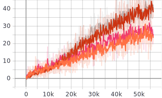

# DL Project: Image Captioning

**Authors:** Joel Moriana, Oscar Redondo, Ferran Pauls, Josep M Carreras

**Mentor:** Carlos Escolano

---

## Index

* [Dataset](##dataset)
* [Ingestion pipeline](##ingestion-pipeline)
* [Model architecture](##model-architecture)
* [Implementation](##implementation)
* [Results](##results)
* [Conclusions and next steps](##conclusions-and-next-steps)

---

## Dataset

The dataset used to build the model is [Flickr8k](http://academictorrents.com/details/9dea07ba660a722ae1008c4c8afdd303b6f6e53b). It contains 8.000 images with five captions each. At the moment there are bigger datasets available, but the intention from the beginning was to test different ideas, so a small dataset has helped us to iterate fast.

The dataset is been splitted into three parts. The trainset to actualize the weights, 6000 images. The validation set to determine when the model has learned and the testset with 1000 images to asses the performance, computing the BLEU metric. 

**Image Dataset**

| Train | Validation | Test |
| -------- | -------- | -------- |
| 6000 Photos    | 1000 Photos    | 1000 Photos    |

**Vocabulary**

| Train | Test |
| -------- | -------- |
| 7.489 non-stopwords| 4.727 non-stopwords|

It is important to asses the model with the same vocabulary distribution as the one it has been trained for, we can see the most frequent words are the same in both datasets

 

 

We can do a similar assessment with the distribution of the caption lengths. We can see that they look alike.

 

It's also important to not expect the model to predict captions with words it hasn't seen before. Those are the most frequent words on the test set that are not in the trainset.

 

## Ingestion pipeline
In this project, the images must be transformated into tensors in order to get the results. In our training set,  we tried two diferent ingestion pipelines, with and without data aumentation, to study how the results change. Here we can see the transformations:

**With Data Augmentation**

******Without Data Augmentation******

## Model architecture

The model is split into two different parts: (1) the encoder and (2) the decoder. The encoder is responsible for processing the input image and extracting the features maps, whereas the the decoder is responsible for processing those features maps and predict the caption.

**Encoder**
The encoder is composed of a Convolutional Neural Network (CNN) and a last linear layer to connect the encoder to the decoder. Due to the reduced dataset we are working on, we use pretrained CNNs on the Imagenet dataset and apply transfer learning. Therefore, the weights of the CNN are frozen during the training and the only trainable parameters of the encoder are the weights of the last linear layer.

**Decoder**
The decoder is composed of a Recurrent Neural Network (RNN) as we are dealing with outputs of variable lengths. Specifically, to avoid vanishing gradients and loosing context in long sequences, we use a a Long Short Term Memory (LSTM) network. 

Depending on the decoder, we differentiate two different model architectures: (1) the baseline model and (2) the attention model. Both models are explained more into detail in the following sections.

### 4.1 Baseline model
This model uses a vanilla LSTM as decoder and the last layer of the encoder inputs the first LSTM iteration as the context vector.

The next picture summarizes the architecture of this model:

We use two different methods depending on if we are on training or inference time:

* In training mode, we use teacher forcing as we know the targets (i.e., we use the ground truth from the prior time step as input to the next LSTM step).
* In inference mode, the model uses the embedding of the previously predicted word to the next LSTM step.

### Attention model
This model is based on the previous one but adding the attention mechanism to the decoder. The attention mechanism is responsible for deciding which parts of the image are more important while predicting a word of the sequence. Therefore, the decoder pays attention to particular areas or objects rather than treating the whole image equally.

Specifically, we are using additivite attention which is a type of soft attention. In constrast to hard attention, soft attention is differentiable and it attends to the entire input space whereas hard attention is not differentiable because it selects the focusing region by random sampling. Therefore, hard attention is not deterministic.

The output of the attention is a conext vector as a weighted sum of the features map computed by the encoder. Each time the model infers a new word in the caption, it will produce an attention map (alphas) which is a probability density function with sum equal to one.

The overall architecture of this model is shown in the next figure. It should be taken into account that the input of each LSTM cell is the concatenation of the embedding and the context vector computed by the attention block.

Similarly to the model explained above, we use teacher forcing while training.

## Implementation

TODO

## Results

### Overfitting
We use a reduced dataset in order to perform overfitting to the models explained above. The following table summarizes the number of pictures contained in each split:

| Train | Validation | Test |
| -------- | -------- | -------- |
| 15 Photos    | 5 Photos    | 5 Photos    |

On the other hand, the next table depicts the selected parameters for the models:

| Parameter | value |
| --- | --- |
| num-epochs | 300 |
| batch-size | 15 |
| learning-rate | 1e-3 |
| encoder-type | `resnet101`, `senet154` |
| attention-type | `none`, `additive` |
| encoder-size | 64 |
| hidden-size | 256 |
| embedding-size | 128 |
| attention-size | 64 |

TODO

### Results

In this section, we use the entire dataset with the following parameters:

| Parameter | value |
| --- | --- |
| num-epochs | 20 |
| batch-size | 32 |
| learning-rate | 1e-3 |
| encoder-type | `resnet101`, `senet154` |
| attention-type | `none`, `additive` |
| encoder-size | 64 |
| hidden-size | 256 |
| embedding-size | 128 |
| attention-size | 64 |
<!---->

**Accuracy**

## Examples

## Conclusions and next steps

**What did we learn?**
* Course Concepts & AI Background.
* How important is the your DataSet.
* Importance of the continous improvement of the architecture.
    

**What would we have liked to do?**
* Keep on improving the performance of our model trying new architectures (Hard Attention, bidirectional decoder...).
* Apply learning rate scheduler, checkpoints.
* Training time changing image quality.
* Build our own image encoder.
* Specific field (eg cars, planes...)
* Bidirectional LSTM

## References
[1] https://www.cv-foundation.org/openaccess/content_cvpr_2015/papers/Karpathy_Deep_Visual-Semantic_Alignments_2015_CVPR_paper.pdf

[2] https://pytorch.org/docs/stable/optim.html

[3] https://blogs.nvidia.com/blog/2019/02/07/what-is-transfer-learning/

[4] https://arxiv.org/pdf/1908.01878v2.pdf

[5] https://www.pyimagesearch.com/2017/03/20/imagenet-vggnet-resnet-inception-xception-keras/

[6] https://lab.heuritech.com/attention-mechanism

[7] https://blog.floydhub.com/attention-mechanism/