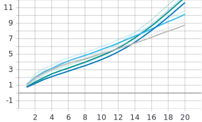

# Image Captioning

## Index

* [Dataset](#dataset)
* [Ingestion pipeline](#ingestion-pipeline)
* [Model architecture](#model-architecture)
* [Implementation](#implementation)
* [Results](#results)
* [Conclusions and next steps](#conclusions-and-next-steps)

---

## Dataset

The dataset used to build the model is [Flickr8k](http://academictorrents.com/details/9dea07ba660a722ae1008c4c8afdd303b6f6e53b). It contains 8.000 images with five captions each. At the moment there are bigger datasets available, but the intention from the beginning was to test different ideas, so a small dataset has helped us to iterate fast.

The dataset is been splitted into three parts. The trainset to actualize the weights, 6000 images. The validation set to determine when the model has learned and the testset with 1000 images to asses the performance, computing the BLEU metric. 

| Train | Validation | Test |
| --- | --- | --- |
| 6000 Photos | 1000 Photos | 1000 Photos |

Example showing an image and its captions:

  

| Image | Caption |
| --- | --- |
44856031_0d82c2c7d1.jpg#0 | A brown dog is sprayed with water .
44856031_0d82c2c7d1.jpg#1 | A dog is being squirted with water in the face outdoors .
44856031_0d82c2c7d1.jpg#2 | A dog stands on his hind feet and catches a stream of water .
44856031_0d82c2c7d1.jpg#3 | A jug is jumping up it is being squirted with a jet of water .
44856031_0d82c2c7d1.jpg#4 | A tan , male dog is jumping up to get a drink of water from a spraying bottle 

### Vocabulary

| Train | Test |
| --- | --- |
| 7.489 non-stopwords| 4.727 non-stopwords|

It is important to asses the model with the same vocabulary distribution as the one it has been trained for, we can see the most frequent words are the same in both datasets

  
  

We can do a similar assessment with the distribution of the caption lengths. We can see that they look alike.

  

It's also important to not expect the model to predict captions with words it hasn't seen before. Those are the most frequent words on the test set that are not in the trainset.

  

## Ingestion pipeline

TODO

## Model architecture

The model is split into two different parts: (1) the encoder and (2) the decoder. The encoder is responsible for processing the input image and extracting the features maps, whereas the the decoder is responsible for processing those features maps and predict the caption.

**Encoder**
The encoder is composed of a Convolutional Neural Network (CNN) and a last linear layer to connect the encoder to the decoder. Due to the reduced dataset we are working on, we use pretrained CNNs on the Imagenet dataset and apply transfer learning. Therefore, the weights of the CNN are frozen during the training and the only trainable parameters of the encoder are the weights of the last linear layer.

**Decoder**
The decoder is composed of a Recurrent Neural Network (RNN) as we are dealing with outputs of variable lengths. Specifically, to avoid vanishing gradients and loosing context in long sequences, we use a a Long Short Term Memory (LSTM) network. 

Depending on the decoder, we differentiate two different model architectures: (1) the baseline model and (2) the attention model. Both models are explained more into detail in the following sections.

### Baseline model
This model uses a vanilla LSTM as decoder and the last layer of the encoder inputs the first LSTM iteration as the context vector.

The next picture summarizes the architecture of this model:

We use two different methods depending on if we are on training or inference time:

* In training mode, we use teacher forcing as we know the targets (i.e., we use the ground truth from the prior time step as input to the next LSTM step).
* In inference mode, the model uses the embedding of the previously predicted word to the next LSTM step.

### Attention model
This model is based on the previous one but adding the attention mechanism to the decoder. The attention mechanism is responsible for deciding which parts of the image are more important while predicting a word of the sequence. Therefore, the decoder pays attention to particular areas or objects rather than treating the whole image equally.

Specifically, we are using additivite attention which is a type of soft attention. In constrast to hard attention, soft attention is differentiable and it attends to the entire input space whereas hard attention is not differentiable because it selects the focusing region by random sampling. Therefore, hard attention is not deterministic.

The output of the attention is a conext vector as a weighted sum of the features map computed by the encoder. Each time the model infers a new word in the caption, it will produce an attention map (alphas) which is a probability density function with sum equal to one.

The overall architecture of this model is shown in the next figure. It should be taken into account that the input of each LSTM cell is the concatenation of the embedding and the context vector computed by the attention block.

Similarly to the model explained above, we use teacher forcing while training.

## Implementation

TODO

## Problems

### The models is always predicting `<START>`

This issue comes up due to two factors:

* We use teacher forcing when training and validating.
* We were using the same transformed caption for training and computing the loss.

Our initial target caption had the following form: ['`<START>`', 'A', 'brown', 'dog', 'is', 'sprayed', 'with', 'water', '`<END>`']

As we were using the same tokenized sequence to compute the loss an train, the model was learning to always predict the input word.

Therefore, while training, the model seemed to learn but at inference time, the model was predicting a sequence of `<START>` words because the first input to the model was the <START> word.

This issue was solved by applying a shift and using two different captions:

* The source caption used for training without the `<END>` token:  ['`<START>`', 'A', 'brown', 'dog', 'is', 'sprayed', 'with', 'water']

* The target caption used to compute the loss without the `<START>` token:  ['A', 'brown', 'dog', 'is', 'sprayed', 'with', 'water']

### No overfitting whithout attention

While doing overfitting without attention, the loss was not converging to zero:

Accuracy train | Accuracy eval
:---:|:---:
   |   

Loss train | Loss eval
:---: | :---:
 |  

This issues was due to we were taking into account the `<PAD>` when computing the loss and that part of the loss was constant. The issue was solved by adding de `ignored_index` =  `<PAD>`.

### Overfitting but low accuracy

The solution of the previous issues, lead to another problem. The model was overfitting because the training loss was converging to zero (whereas the validation loss was increasing) but the accuracy was not increasing:

Accuracy train | Accuracy eval
:---:|:---:
   |   

Loss train | Loss eval
:---: | :---:
 |  

The issue came up because we were taking into account the words predicted after the <`END`> and therefore there was a penalty when computing the BLEU.

## Results

### Overfitting

Accuracy train | Accuracy eval
:---:|:---:
   |   

Loss train | Loss eval
:---: | :---:
 |  

We use a reduced dataset in order to perform overfitting to the models explained above. The following table summarizes the number of pictures contained in each split:

| Train | Validation | Test |
| -------- | -------- | -------- |
| 15 Photos    | 5 Photos    | 5 Photos    |

On the other hand, the next table depicts the selected parameters for the models:

| Parameter | Value |
| --- | --- |
| num-epochs | 300 |
| batch-size | 15 |
| learning-rate | 1e-3 |
| encoder-type | `resnet101`, `senet154` |
| attention-type | `none`, `additive` |
| encoder-size | 64 |
| hidden-size | 256 |
| embedding-size | 128 |
| attention-size | 64 |

### Results

Accuracy train | Accuracy eval
:---:|:---:
   |   

Loss train | Loss eval
:---: | :---:
 |  

In this section, we use the entire dataset with the following parameters:

| Parameter | Value |
| --- | --- |
| num-epochs | 20 |
| batch-size | 32 |
| learning-rate | 1e-3 |
| encoder-type | `resnet101`, `senet154` |
| attention-type | `none`, `additive` |
| encoder-size | 64 |
| hidden-size | 256 |
| embedding-size | 128 |
| attention-size | 64 |

## Examples

## Conclusions and next steps

**What did we learn?**
* Course Concepts & AI Background.
* How important is to study the dataset.
* Importance of the continous improvement of the architecture.

**What would we have liked to do?**
* Keep on improving the performance of our model trying new architectures (bidirectional decoder...).
* Apply learning rate scheduler, checkpoints.
* Fine tune encoder or build our own (big dataset needed).
* Use pretrained word embeddings.
* Specific field (e.g., cars, planes...).